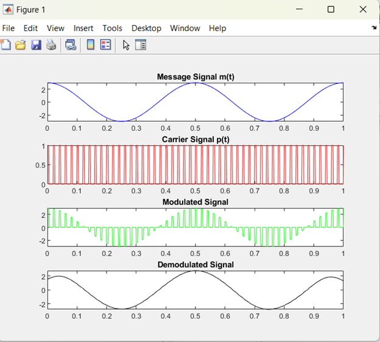
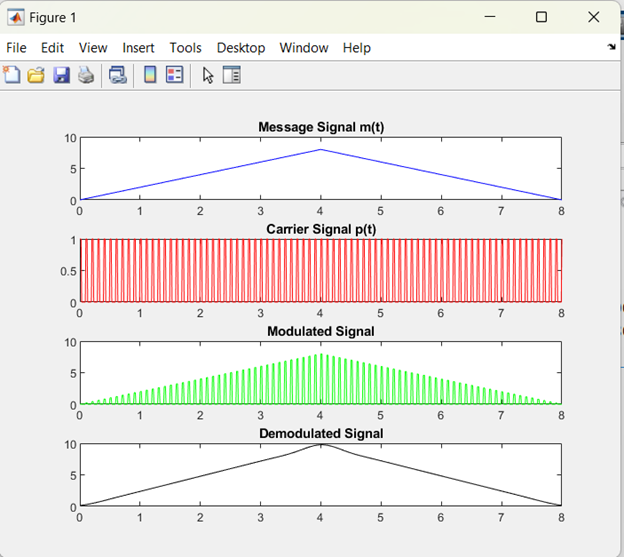
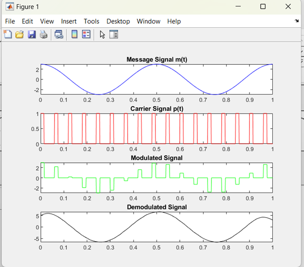
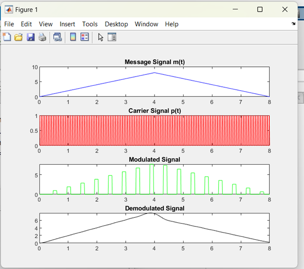
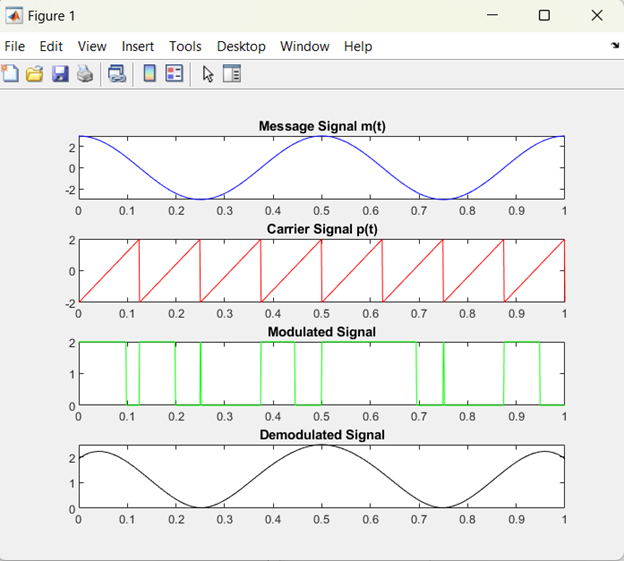
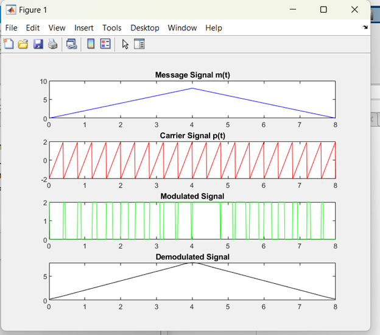
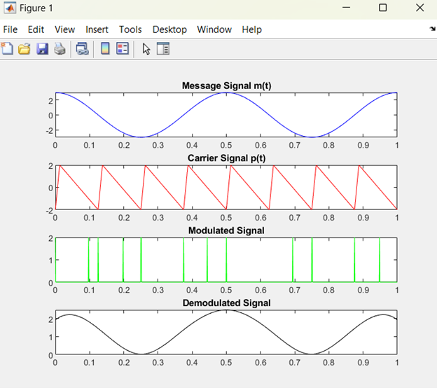
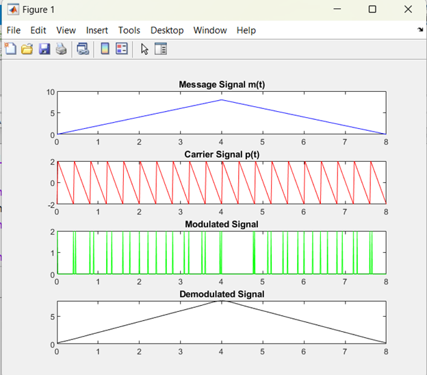

# 📡 Pulse Modulation Techniques: PAM, Flat-Top PAM, PWM & PPM

## 🌍 Overview

This project implements and visualizes four fundamental pulse modulation techniques:

- Pulse Amplitude Modulation (PAM)
- Flat-Top Pulse Amplitude Modulation (Flat-Top PAM)
- Pulse Width Modulation (PWM)
- Pulse Position Modulation (PPM)

For each technique, both **modulation** and **demodulation** are demonstrated using simple mathematical models and signal plots.

## ✨ Features

- Implementation of:
  - **PAM** (pulse amplitude modulation & demodulation)
  - **Flat-Top PAM** (sample-and-hold modulation & demodulation)
  - **PWM** (duty-cycle based modulation & reconstruction)
  - **PPM** (pulse position based modulation & detection)
- Time-domain visualization of message, carrier/pulse train, and modulated waveforms.
- Simple mathematical expressions included for each technique.
- Waveform figures for documentation and reports.

## 🧩 Project Parts (Brief Explanation, Math & Figures)

---

### 1️⃣ PAM (Pulse Amplitude Modulation)

**Concept**

**Pulse Amplitude Modulation (PAM)** encodes the information in the **amplitude of periodic pulses**.

**🖼️ Figures (PAM)**  

| PAM m1(t) | PAM m2(t) |
| ------------ | ------------ |
|  |  |

---

### 2️⃣ Flat-Top PAM

**Concept**

**Flat-Top PAM** is a variation of PAM where each pulse is **sampled and then held at a constant level** for the entire pulse duration. This produces “flat-top” pulses which make detection easier and reduce certain types of distortion.

**🖼️ Figures (Flat-Top PAM)**  

| Flat-Top PAM m1(t)| Flat-Top PAM m2(t) |
| --------------------- | --------------------- |
|  |  |

---

### 3️⃣ PWM (Pulse Width Modulation)

**Concept**

In **Pulse Width Modulation (PWM)**, the **width (duty cycle)** of each pulse is varied in proportion to the amplitude of the message signal, while the amplitude and position of the pulses remain fixed.

**🖼️ Figures (PWM)**  

| PWM m1(t) | PWM m2(t) |
| ------------ | ------------ |
|  |  |

---

### 4️⃣ PPM (Pulse Position Modulation)

**Concept**

In **Pulse Position Modulation (PPM)**, the **position (timing)** of each pulse within a time slot encodes the information, while the amplitude and width of the pulses remain constant.

**🖼️ Figures (PPM)**  

| PPM m1(t) | PPM m2(t) |
| ------------ | ------------ |
|  |  |

---

## 📄 License

⚠️ **Important Notice:** This repository is publicly available for viewing only. Forking, cloning, or redistributing this project is **NOT** permitted without explicit permission.

Copyright (c) 2024 Chameleon Tech
